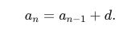
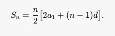
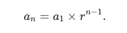
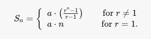
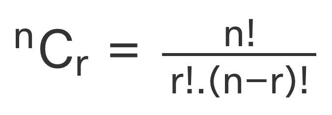
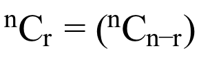
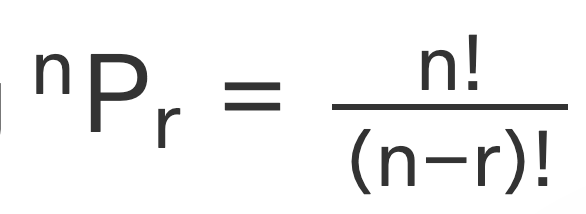

# Some useful maths formulas

## GCD - Euclid's Algo

```d
gcd(a, b) = gcd(b%a, a) if a > 0
gcd(a, b) = b           if a == 0
```

#### Pseudocode - Iterative

```d
function gcd(a, b):
    while a != 0:
        a, b = b%a, b
    return b
```

#### Pseudocode - Recursive

```d
function gcd(a, b):
    if a == 0:
        return b
    return gcd(b%a, b)
```

## LCM

Compute using the formula

```d
gcd(a, b) * lcm(a, b) = a * b
```

Compute GCD using Euclid's algo and find LCM with the above formula.

#### Pseudocode

```d
function lcm(a, b):
    return (a * b) / gcd(a, b)
```

## Arithmetic Progression - AP

An arithmetic progression (AP), also called an arithmetic sequence, is a sequence of numbers which differ from each other by a common difference. For example, the sequence 2, 4, 6, 8, ... is an arithmetic sequence with the common difference 2.

Let `d` = common difference \
Let `a` = first term

#### Formula for Nth term



```d
T(n) = a + (n - 1) * d
```

#### Sum of AP



```d
S(n) = (2 * a + (n - 1) * d) * n / 2
```

## Geometric Progression - GP

A geometric progression (GP), also called a geometric sequence, is a sequence of numbers which differ from each other by a common ratio. For example, the sequence 2, 4, 8, 16, ... is a geometric sequence with common ratio 2.

Let `a` = Initial Term \
Let `r` = Common ratio

#### Nth term



```py
T(n) = a * pow(r, n-1)
```

#### Sum of GP



```d
S(n) = a * ((pow(r,n) - 1)/(r - 1))     if r != 1
S(n) = a * n                            if r == 1
```

## Combinations

The combination is a way of selecting items from a collection, such that the order of selection does not matter.

#### Formula:



```d
C(N, R) = N! / ((N-R)! * R!)
```

#### Pseudocode

```d
function combination(n, r):
    numerator = factorial(n)
    denominator = factorial(n-r) * factorial(r)
    return numerator / denominator
```

#### Recursive Formula:

```d
C(n, r) = 1                         ,if r = 0 or if r = n
C(n, r) = C(n-1, r-1) + C(n-1, r)   ,all other cases
```

#### Pseudocode - Recursive

```d
function combination(n, r):
    if r == 0 or r == n:
        return 1
    return combination(n-1, r-1) + combination(n-1, r)
```

#### Important Property



```d
C(n, r) = C(n, n - r)
```

## Permutations

A permutation is a mathematical technique that determines the number of possible arrangements in a set when the order of the arrangements matters.

#### Formula


```d
P(n, r) = n! / (n-r)!
```

#### Pseudocode

```d
function permutation(n, r):
    numerator = factorial(n)
    denominator = factorial(n-r)
    return numerator / denominator
```

## Decimal to Binary

In order to convert a decimal number to binary, repeatedly divide by two until you reach 0. Store the remainders seperately and the resultant string of those remainders in reverse order is the binary equivalant.

#### Pseudocode

```d
// n is an integer
function decimalToBinary(n):
    result = ""
    while n > 0:
        remainder = n % 2
        result = toString(remainder) + result
        n = n / 2    // Integer division
    return result
```

## Binary to Decimal

To convert a binary string to decimal integer, start iterating from the right and multiply each digit by `pow(2, i)` where `i` is the position of the digit from right (0 based).

#### Pseudocode

```d
// n is a binary string
function binaryToDecimal(n):
    i = 0
    result = 0
    for digit in reversed(n):
        digit = strToInt(digit)
        result += digit * pow(2, i)
        i = i + 1
    return result
```

## Modulo Properties

Modulo represents the remainder of two numbers. Generally denoted by the `%` operator.

It can be computed as:

```d
a - (a/b) * b
```

Some commonly used modulo properties:

```d
( a + b) % c = ( ( a % c ) + ( b % c ) ) % c
( a * b) % c = ( ( a % c ) * ( b % c ) ) % c
( a – b) % c = ( ( a % c ) – ( b % c ) ) % c
```
